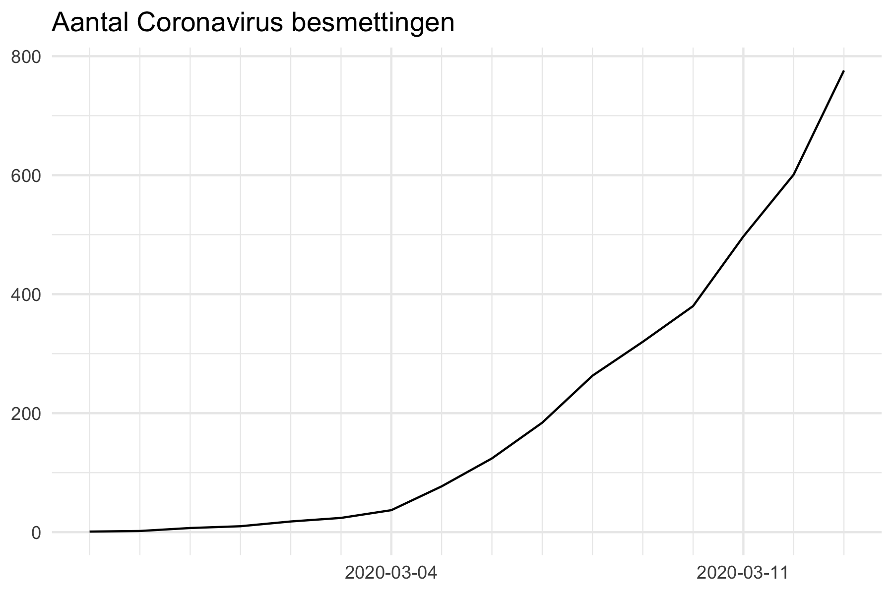
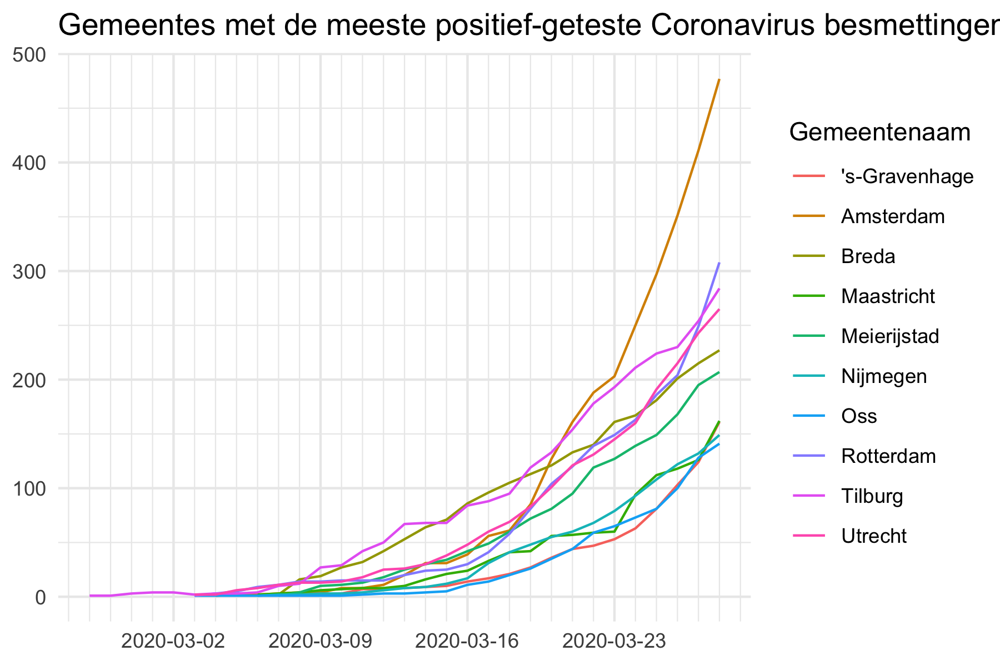

# Coronavirus disease in The Netherlands based on RIVM reports

:exclamation: Daily updates :exclamation:

The current outbreak of coronavirus disease (COVID-19) that was first reported from Wuhan, China, on 31 December 2019. On 27 February 2019, a patient in The Netherlands was diagnosed with the coronavirus (COVID-19), according to the RIVM (National Institute for Public Health and the Environment). Within a week, more than a hundred cases were confirmed. The RIVM reports the number of positive cases on its [website](https://www.rivm.nl/nieuws/actuele-informatie-over-coronavirus). 

Since 3 March, RIVM reports the number of diagnoses with the coronavirus and their municipality of residence on a daily base. The data contains the total number of positively tested patients. It is not a dataset with the current number of sick people in the Netherlands. The RIVM does not currently provide data on people who have been cured. The [raw numbers]( https://www.volksgezondheidenzorg.info/onderwerp/infectieziekten/regionaal-internationaal/coronavirus-covid-19#definities) can be found on the government-owned website https://www.volksgezondheidenzorg.info.  

## This project

At the moment of writing, RIVM and https://www.volksgezondheidenzorg.info don't publish datasets with the date of diagnosis on their websites. Therefore, it is hard to get an overview of development in time (and municipality). This information is important information for journalists and scientists to do their job as well as for the public. Therefore, this project downloads the latest numbers from the website of the RIVM **every hour** and pushes the data to this repo. Please see the folder  [raw_data/](raw_data/) for the non-processed data downloaded from RIVM. The folder [data/](data/) contains processed datasets ready to use for analysis. 

Datasets:

  - :page_facing_up: [RIVM Coronavirus data in NL since March 3](data/rivm_corona_in_nl.csv)
 
## Get involved

Help on this project is appreciated. We are looking for new graphs, maps, enriched datasets and interactive visualisations. Please report issues in the Issue Tracker. 

Todo:

- [ ] Reconstruct data 27 February 2019 - 2 March 2019 (not available, but can be derived from news reports of RIVM)
- [ ] Add map with reported cases

See https://github.com/J535D165/CoronaWatchNL/actions and [/.github/workflows](/.github/workflows) for technical details regarding data collection and scheduling.

## :chart_with_upwards_trend: Graphs

The following graphs show the development of Coronavirus on a daily basis. The underlying data can be found in [data/rivm_corona_in_nl.csv](data/rivm_corona_in_nl.csv). The [graphs](/graphs) are updated on an hourly basis and were generated automatically. Please validate the numbers in the graphs before publishing. See the license section for information about sharing the graphs.

## License

The graphs and data are licensed [CC0](https://creativecommons.org/share-your-work/public-domain/cc0/). The original data is copyright RIVM. For academic use, please cite `De Bruin, J 2020. RIVM reported numbers on the Coronavirus outbreak in The Netherlands https://github.com/J535D165/CoronaWatchNL`

## Contact

Please reach out at jonathandebruinos@gmail.com
