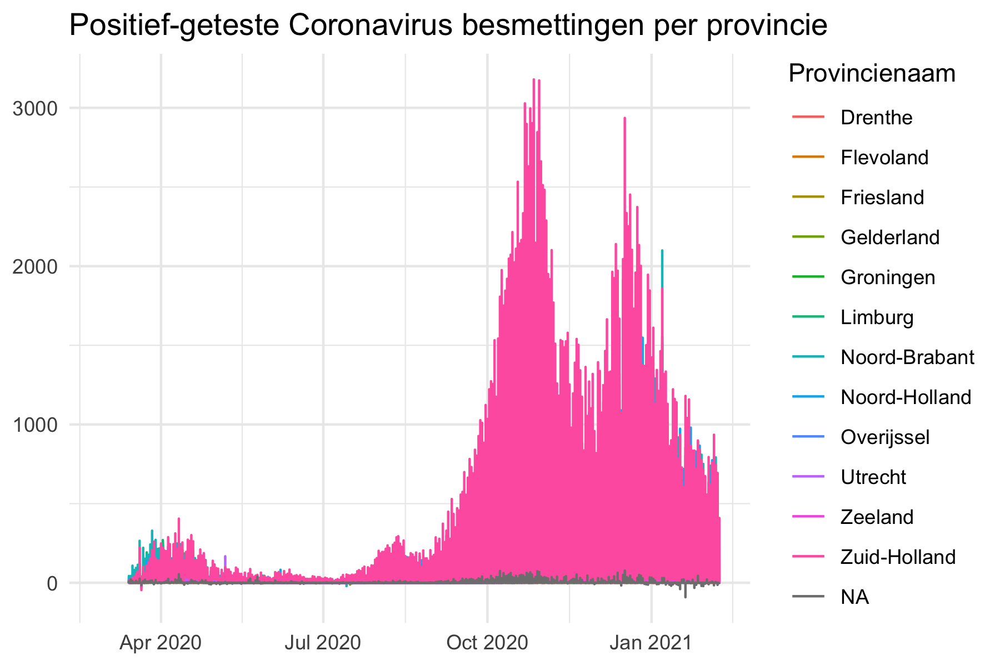

# Ontwikkeling van het coronavirus, gebaseerd op RIVM data


Op 31 december 2019 werd in Wuhan, China de eerste besmetting met het Coronavirus (COVID-19) gemeld. Op 27 februari 2020 werd het eerste geval in Nederland gemeld door de RIVM. Binnen een week werden meer dan honderd nieuwe gevallen bevestigd. Het RIVM vermeldt de aantallen positief geteste mensen op hun [website](https://www.rivm.nl/nieuws/actuele-informatie-over-coronavirus).

Vanaf 3 maart vermeldt het RIVM ook dagelijks de aantallen per gemeente op de website. De dataset bevat niet alle besmette personen, alleen de positief geteste gevallen. Verder vermeldt het RIVM op dit moment ook geen beter gemelde personen. ~De  [ruwe data]( https://www.volksgezondheidenzorg.info/onderwerp/infectieziekten/regionaal-internationaal/coronavirus-covid-19#definities) is te vinden op deze site van de overheid https://www.volksgezondheidenzorg.info.~ De meest recente aantallen kunnen gevonden worden op https://www.rivm.nl/coronavirus-kaart-van-nederland. 

## Dit project :exclamation: Dagelijkse updates :exclamation:

Op dit moment delen RIVM en https://www.volksgezondheidenzorg.info geen datasets met de datum van diagnose op de sites. Het is daarom lastig om een overzicht te krijgen van het tijdsverloop (en gemeente). Deze informatie is belangrijk voor journalisten, onderzoekers en iedereen die geinteresseerd is. Dit project downloadt daarom **ieder uur** de laatste gegevens van de RIVM naar de repo. In de map [raw_data/](raw_data/) is deze gedownloade en niet-verwerkte data van het RIVM te vinden. De map [data/](data/) bevat datasets die gereed gemaakt zijn voor analyse. 

Datasets:

  - :page_facing_up: [RIVM Coronavirus: Positief geteste patienten in Nederland](data/rivm_corona_in_nl_daily.csv) 
  - :page_facing_up: [RIVM Coronavirus: overleden patienten in Nederland](data/rivm_corona_in_nl_fatalities.csv) 
  - :page_facing_up: [RIVM Coronavirus: opgenomen patienten in Nederland](data/rivm_corona_in_nl_hosp.csv) 
  - :page_facing_up: RIVM Coronavirus: aantallen per gemeente  in Nederland [[long format]](data/rivm_corona_in_nl.csv) [[wide format]](data/rivm_corona_in_nl_table.csv) 

For academisch gebruik is er deze vermelding:  [](https://doi.org/10.5281/zenodo.3711575) en deze paragraaf lezen [License and academic use](#license-and-academic-use)


## Help ons

Hulp wordt gewaardeerd! We zijn op zoek naar nieuwe grafieken, kaarten, verrijkte datasets en interactieve visualisaties. 

Vermeld problemen svp in de [Issue Tracker] van Github. 

Wil je helpen? Kijk dan naar de issues met een `help wanted` vermelding in de [Issue Tracker](https://github.com/J535D165/CoronaWatchNL/issues).

Lees https://github.com/J535D165/CoronaWatchNL/actions and [/.github/workflows](/.github/workflows) voor technische details rond data verzameling en het ophalen ervan op geplande tijdstippen.

## :chart_with_upwards_trend: Grafieken

De volgende grafieken laten de dagelijkse ontwikkeling van het Coronavirus zien. De bijhorende data is hier te vinden: [data/rivm_corona_in_nl.csv](data/rivm_corona_in_nl.csv). De [grafieken](/graphs) worden ieder uur bijgewerkt en worden automatisch gegenereerd. Controleer de getallen voor publicatie en lees het deel over licenties voor deze te delen. 





### Kaarten


### Voorspellingen

De eerste voorspellingen zijn gebaseerd op modellen voor exponentiele groei. 

De data laat nu echter een ander beeld zien dan exponentiele groei. Als we de data op een logaritmische schaal zetten, dan wijkt de data drastisch af van de lijn!


We proberen daarom een sigmoide functie. Een manier om dit passend te maken, is om de mate van groei te bepalen. Deze definieren we als de ratio van nieuwe gevallen over nieuwe gevallen uit de eerdere periode. Asl deze ratio 1 bereikt, dan is de kans groot dat de groei geen exponentiele curve volgt, maar afneemt naar een sigmoide functie. Hier is de ontwikkeling van de groeifactor over tijd, met een lineair model om te bepalen wanneer dit moment zich voor zal doen. 


Dit leidt dan tot de volgende sigmoide functie:


Voor meer informatie over de aanpak, is er deze [YouTube video](https://www.youtube.com/watch?v=Kas0tIxDvrg) door Grant Sanderson, die ons inspireerde tot deze aanpak
([3Blue1Brown](https://www.youtube.com/channel/UCYO_jab_esuFRV4b17AJtAw)).

## Interessante links

- https://medium.com/@tomaspueyo/coronavirus-act-today-or-people-will-die-f4d3d9cd99ca
- http://www.casperalbers.nl/nl/post/2020-03-11-coronagrafieken/
- https://worktimesheet2014.blogspot.com/2020/03/coronovirus-in-netherlands-power-bi.html (Made with CoronaWatchNL data)
- https://www.youtube.com/watch?v=Kas0tIxDvrg

## Licentie and academisch gebruik

De grafieken en data vallen on de de volgende licentie [CC0](https://creativecommons.org/share-your-work/public-domain/cc0/). De originele data is copyright RIVM. 

Voor academic gebruik, gebruik presistente data van [](https://doi.org/10.5281/zenodo.3711575). Dit is een persistent kopie van de data. Het versienummer verwijst naar de datum. Please cite:

```De Bruin, J. (2020). Number of diagnoses with coronavirus disease (COVID-19) in The Netherlands (Version v2020.3.15) [Data set]. Zenodo. http://doi.org/10.5281/zenodo.3711575```

Image from [iXimus](https://pixabay.com/nl/users/iXimus-2352783/?utm_source=link-attribution&amp;utm_medium=referral&amp;utm_campaign=image&amp;utm_content=4901881) via [Pixabay](https://pixabay.com/nl/?utm_source=link-attribution&amp;utm_medium=referral&amp;utm_campaign=image&amp;utm_content=4901881)

## Contact

Stuur een mail naar jonathandebruinos@gmail.com


---- English ----

# Coronavirus disease in The Netherlands based on RIVM reports


The current outbreak of coronavirus disease (COVID-19) that was first reported from Wuhan, China, on 31 December 2019. On 27 February 2020, a patient in The Netherlands was diagnosed with the coronavirus (COVID-19), according to the RIVM (National Institute for Public Health and the Environment). Within a week, more than a hundred cases were confirmed. The RIVM reports the number of positive cases on its [website](https://www.rivm.nl/nieuws/actuele-informatie-over-coronavirus).

Since 3 March, RIVM reports the number of diagnoses with the coronavirus and their municipality of residence on a daily base. The data contains the total number of positively tested patients. It is not a dataset with the current number of sick people in the Netherlands. The RIVM does not currently provide data on people who have been cured. ~The [raw numbers]( https://www.volksgezondheidenzorg.info/onderwerp/infectieziekten/regionaal-internationaal/coronavirus-covid-19#definities) can be found on the government-owned website https://www.volksgezondheidenzorg.info.~ The most recent numbers can be found at https://www.rivm.nl/coronavirus-kaart-van-nederland. 


## This project :exclamation: Daily updates :exclamation:

At the moment of writing, RIVM and https://www.volksgezondheidenzorg.info don't publish datasets with the date of diagnosis on their websites. Therefore, it is hard to get an overview of development in time (and municipality). This information is important to journalists and scientists as well as for the public. Therefore, this project downloads the latest numbers from the website of the RIVM **every hour** and pushes the data to this repo. Please see the folder  [raw_data/](raw_data/) for the non-processed data downloaded from RIVM. The folder [data/](data/) contains processed datasets ready to use for analysis.

Datasets:

  - :page_facing_up: [RIVM Coronavirus counts in The Netherlands](data/rivm_corona_in_nl_daily.csv) 
  - :page_facing_up: [RIVM Coronavirus fatalities in The Netherlands](data/rivm_corona_in_nl_fatalities.csv) 
  - :page_facing_up: [RIVM Coronavirus hospitalizations in The Netherlands](data/rivm_corona_in_nl_hosp.csv) 
  - :page_facing_up: RIVM Coronavirus counts in The Netherlands for each municipality [[long format]](data/rivm_corona_in_nl.csv) [[wide format]](data/rivm_corona_in_nl_table.csv) 

For academic use, please use  [](https://doi.org/10.5281/zenodo.3711575) and see the section [License and academic use](#license-and-academic-use)


## Get involved

Help on this project is appreciated. We are looking for new graphs, maps, enriched datasets and interactive visualisations. Please report issues in the Issue Tracker. Want to contribute? Please check out the `help wanted` tag in the [Issue Tracker](https://github.com/J535D165/CoronaWatchNL/issues).

See https://github.com/J535D165/CoronaWatchNL/actions and [/.github/workflows](/.github/workflows) for technical details regarding data collection and scheduling.

## :chart_with_upwards_trend: Graphs

The following graphs show the development of Coronavirus on a daily basis. The underlying data can be found in [data/rivm_corona_in_nl.csv](data/rivm_corona_in_nl.csv). The [graphs](/graphs) are updated on an hourly basis and were generated automatically. Please validate the numbers in the graphs before publishing. See the license section for information about sharing the graphs.


### Maps


### Forecast

The first predictions are based on exponential growth model.


Note, however that the data no longer behave exponentially. If we plot them on
a log axis they deviate from the line quite drastically!


Thus we try to fit a sigmoidal curve. One way to fit this, is to first estimate
the growth rate, which we define here as the ratio of new cases over previous
new cases. Once this growth rate reaches 1, it is likely that the data will
stop following an exponential pattern and will taper down into a sigmoid
curvature.

Here is the development of the growth factor over time, with a linear model fit
to try to estimate when the inflection point will occur (or has occurred).


This then results in the following sigmoidal fit:


For more information about this approach, please watch
[the YouTube video](https://www.youtube.com/watch?v=Kas0tIxDvrg) that inspired
this approach, by Grant Sanderson
([3Blue1Brown](https://www.youtube.com/channel/UCYO_jab_esuFRV4b17AJtAw)).

## Interesting links

- https://medium.com/@tomaspueyo/coronavirus-act-today-or-people-will-die-f4d3d9cd99ca
- http://www.casperalbers.nl/nl/post/2020-03-11-coronagrafieken/
- https://worktimesheet2014.blogspot.com/2020/03/coronovirus-in-netherlands-power-bi.html (Made with CoronaWatchNL data)
- https://www.youtube.com/watch?v=Kas0tIxDvrg

## License and academic use

The graphs and data are licensed [CC0](https://creativecommons.org/share-your-work/public-domain/cc0/). The original data is copyright RIVM. 

For academic use, use presistent data from [](https://doi.org/10.5281/zenodo.3711575). This is a persistent copy of the data. Version number refer to the date. Please cite:

```De Bruin, J. (2020). Number of diagnoses with coronavirus disease (COVID-19) in The Netherlands (Version v2020.3.15) [Data set]. Zenodo. http://doi.org/10.5281/zenodo.3711575```

Image from [iXimus](https://pixabay.com/nl/users/iXimus-2352783/?utm_source=link-attribution&amp;utm_medium=referral&amp;utm_campaign=image&amp;utm_content=4901881) via [Pixabay](https://pixabay.com/nl/?utm_source=link-attribution&amp;utm_medium=referral&amp;utm_campaign=image&amp;utm_content=4901881)

## Contact

Please reach out at jonathandebruinos@gmail.com
