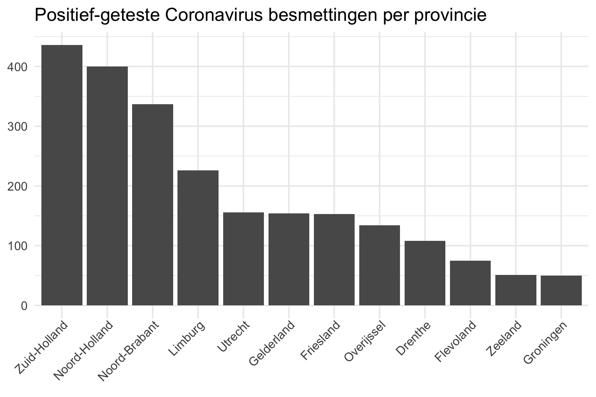

# [Ontwikkeling van het coronavirus, gebaseerd op RIVM data](Dutch.md)

# ---- English ----

# Coronavirus disease in The Netherlands based on RIVM reports


The current outbreak of coronavirus disease (COVID-19) that was first reported from Wuhan, China, on 31 December 2019. On 27 February 2020, a patient in The Netherlands was diagnosed with the coronavirus (COVID-19), according to the RIVM (National Institute for Public Health and the Environment). Within a week, more than a hundred cases were confirmed. The RIVM reports the number of positive cases on its [website](https://www.rivm.nl/nieuws/actuele-informatie-over-coronavirus).

Since 3 March, RIVM reports the number of diagnoses with the coronavirus and their municipality of residence on a daily base. The data contains the total number of positively tested patients. It is not a dataset with the current number of sick people in the Netherlands. The RIVM does not currently provide data on people who have been cured. ~The [raw numbers]( https://www.volksgezondheidenzorg.info/onderwerp/infectieziekten/regionaal-internationaal/coronavirus-covid-19#definities) can be found on the government-owned website https://www.volksgezondheidenzorg.info.~ The most recent numbers can be found at https://www.rivm.nl/coronavirus-kaart-van-nederland. 


## This project :exclamation: Daily updates :exclamation:

At the moment of writing, RIVM and https://www.volksgezondheidenzorg.info don't publish datasets with the date of diagnosis on their websites. Therefore, it is hard to get an overview of development in time (and municipality). This information is important to journalists and scientists as well as for the public. Therefore, this project downloads the latest numbers from the website of the RIVM **every hour** and pushes the data to this repo. Please see the folder  [raw_data/](raw_data/) for the non-processed data downloaded from RIVM. The folder [data/](data/) contains processed datasets ready to use for analysis.

Datasets:

  - :page_facing_up: [RIVM Coronavirus counts in The Netherlands](data/rivm_corona_in_nl_daily.csv) 
  - :page_facing_up: [RIVM Coronavirus fatalities in The Netherlands](data/rivm_corona_in_nl_fatalities.csv) 
  - :page_facing_up: [RIVM Coronavirus hospitalizations in The Netherlands](data/rivm_corona_in_nl_hosp.csv) 
  - :page_facing_up: RIVM Coronavirus counts in The Netherlands for each municipality [[long format]](data/rivm_corona_in_nl.csv) [[wide format]](data/rivm_corona_in_nl_table.csv) 

For academic use, please use  [](https://doi.org/10.5281/zenodo.3711575) and see the section [License and academic use](#license-and-academic-use)


## Get involved

Help on this project is appreciated. We are looking for new graphs, maps, enriched datasets and interactive visualisations. Please report issues in the Issue Tracker. Want to contribute? Please check out the `help wanted` tag in the [Issue Tracker](https://github.com/J535D165/CoronaWatchNL/issues).

See https://github.com/J535D165/CoronaWatchNL/actions and [/.github/workflows](/.github/workflows) for technical details regarding data collection and scheduling.

## :chart_with_upwards_trend: Graphs

The following graphs show the development of Coronavirus on a daily basis. The underlying data can be found in [data/rivm_corona_in_nl.csv](data/rivm_corona_in_nl.csv). The [graphs](/graphs) are updated on an hourly basis and were generated automatically. Please validate the numbers in the graphs before publishing. See the license section for information about sharing the graphs.





### Maps##


### Forecast

The first predictions are based on exponential growth model.


Note, however that the data no longer behave exponentially. If we plot them on
a log axis they deviate from the line quite drastically!


Thus we try to fit a sigmoidal curve. One way to fit this, is to first estimate
the growth rate, which we define here as the ratio of new cases over previous
new cases. Once this growth rate reaches 1, it is likely that the data will
stop following an exponential pattern and will taper down into a sigmoid
curvature.

Here is the development of the growth factor over time, with a linear model fit
to try to estimate when the inflection point will occur (or has occurred).


This then results in the following sigmoidal fit:


For more information about this approach, please watch
[the YouTube video](https://www.youtube.com/watch?v=Kas0tIxDvrg) that inspired
this approach, by Grant Sanderson
([3Blue1Brown](https://www.youtube.com/channel/UCYO_jab_esuFRV4b17AJtAw)).

## Interesting links

- https://medium.com/@tomaspueyo/coronavirus-act-today-or-people-will-die-f4d3d9cd99ca
- http://www.casperalbers.nl/nl/post/2020-03-11-coronagrafieken/
- https://worktimesheet2014.blogspot.com/2020/03/coronovirus-in-netherlands-power-bi.html (Made with CoronaWatchNL data)
- https://www.youtube.com/watch?v=Kas0tIxDvrg

## License and academic use

The graphs and data are licensed [CC0](https://creativecommons.org/share-your-work/public-domain/cc0/). The original data is copyright RIVM. 

For academic use, use presistent data from [](https://doi.org/10.5281/zenodo.3711575). This is a persistent copy of the data. Version number refer to the date. Please cite:

```De Bruin, J. (2020). Number of diagnoses with coronavirus disease (COVID-19) in The Netherlands (Version v2020.3.15) [Data set]. Zenodo. http://doi.org/10.5281/zenodo.3711575```

Image from [iXimus](https://pixabay.com/nl/users/iXimus-2352783/?utm_source=link-attribution&amp;utm_medium=referral&amp;utm_campaign=image&amp;utm_content=4901881) via [Pixabay](https://pixabay.com/nl/?utm_source=link-attribution&amp;utm_medium=referral&amp;utm_campaign=image&amp;utm_content=4901881)

## Contact

Please reach out at jonathandebruinos@gmail.com
