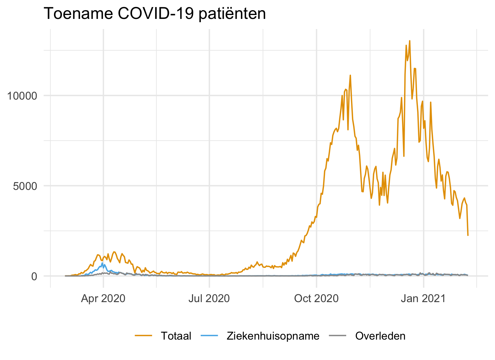
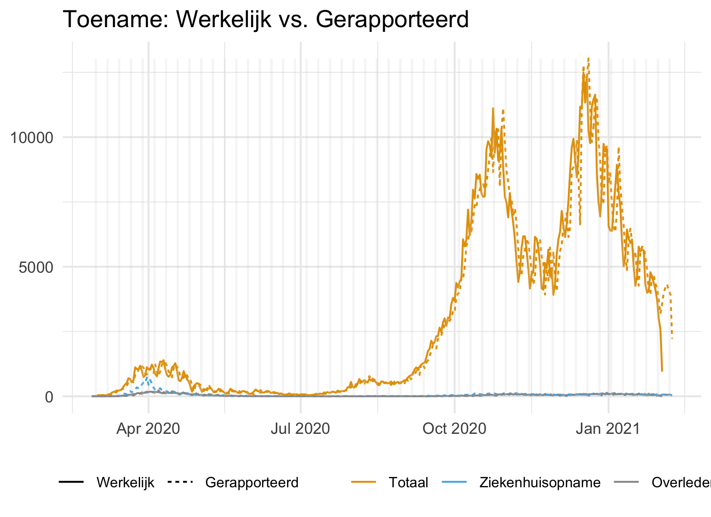
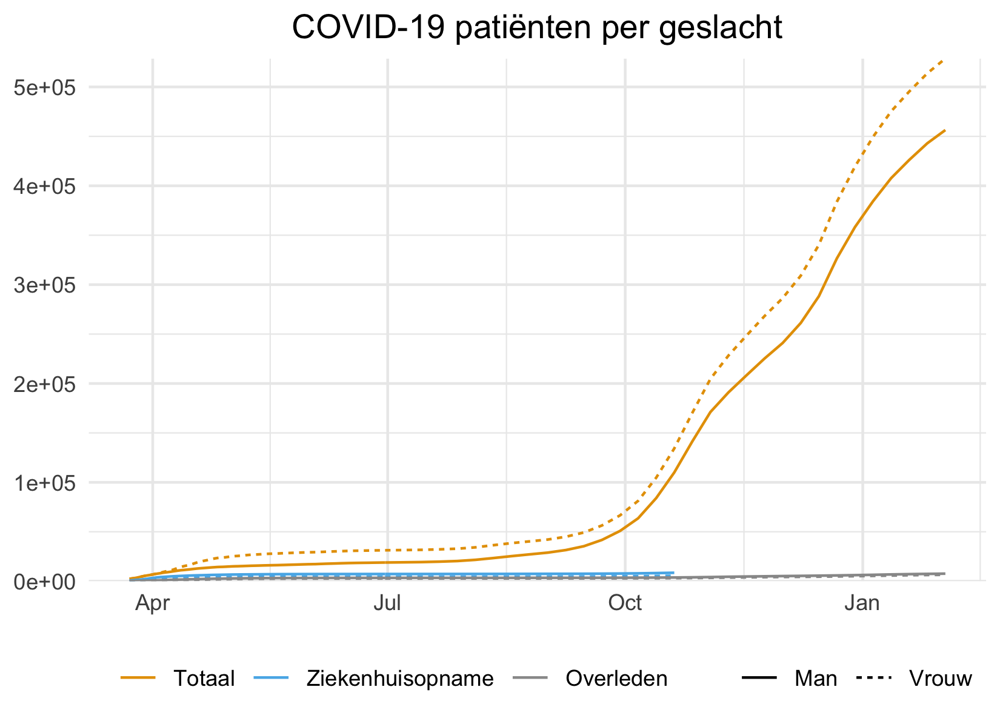
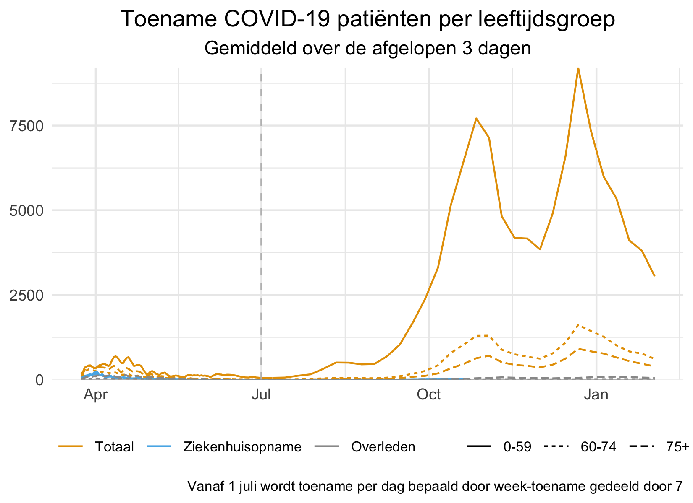
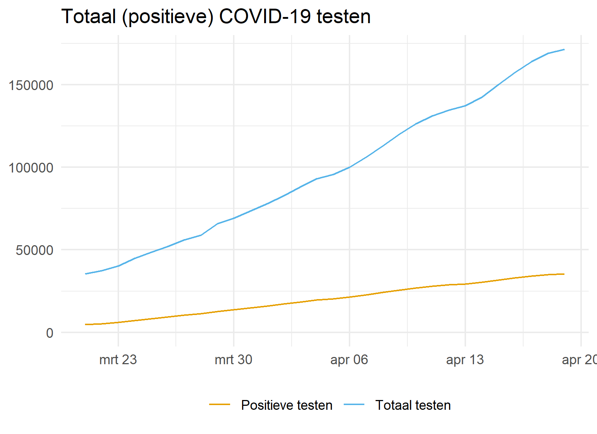
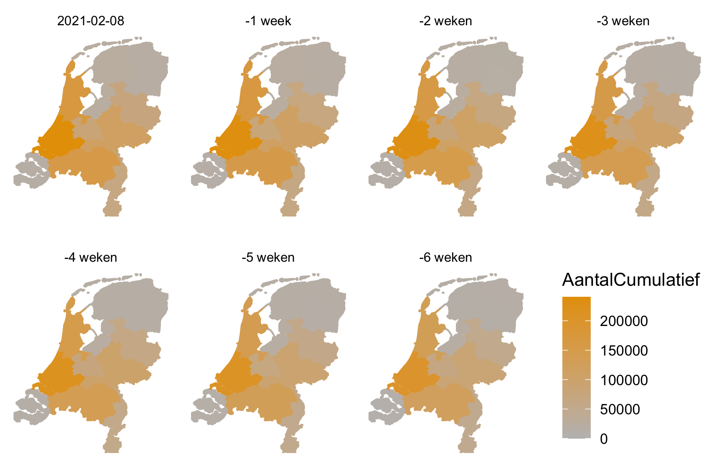

# Dataset: COVID-19 case counts in The Netherlands

**CoronaWatchNL** collects COVID-19 disease count cases in **The Netherlands**. Numbers are collected from the RIVM (National Institute for Public Health and the Environment) website on a daily basis. This project standardizes, and publishes data and makes it **Findable, Accessible, Interoperable, and Reusable (FAIR)**. We aim to collect a complete time series and prepare a dataset for reproducible analysis and academic use.

Dutch:
> CoronalWatchNL verzamelt ziektecijfers over COVID-19 in Nederland. Dagelijks worden de cijfers verzameld van de website van het RIVM. Dit project standaardiseert en publiceert de gegevens en maakt ze vindbaar, toegankelijk, interoperabel en herbruikbaar (FAIR). We streven ernaar om een dataset beschikbaar te stellen voor reproduceerbare analyses en wetenschappelijk gebruik.


## Datasets

The following datasets are available for reuse. :exclamation: Daily updates :exclamation:

| Dataset | Source | Variables |
|---|---| --- |
| [COVID-19 reported case counts by date in NL](data/rivm_NL_covid19_national.csv) | RIVM | Date, Type (Total, hopitalized and deceased patients), Count (the reported numbers for that day)|
| [COVID-19 case counts by date in NL (NEW)](data/rivm_NL_covid19_national_by_date/) | RIVM | Date, Type (Total, hopitalized and deceased patients), Count (the actual numbers for that day)|
| [COVID-19 case counts in NL per province](data/rivm_NL_covid19_province.csv) | RIVM | Date, Province, COVID-19 case counts|
| [COVID-19 hospitalizations in NL per municipality](data/rivm_NL_covid19_hosp_municipality.csv) | RIVM | Date, Number of COVID-19 hospitalized patients in NL, Municipality of residence, Municipality code (2019), Province |
| [COVID-19 fatalities in NL per municipality (NEW)](data/rivm_NL_covid19_fatalities_municipality.csv) | RIVM | Date, Number of COVID-19 deceased patients in NL, Municipality of residence, Municipality code (2019), Province |
| [COVID-19 case counts in NL per age](data/rivm_NL_covid19_age.csv) | RIVM | Date, Age group, Type, Number of positive COVID-19 disease cases in NL|
| [COVID-19 case counts in NL per gender](data/rivm_NL_covid19_sex.csv) | RIVM | Date, Gender group, Type, Number of positive COVID-19 disease cases in NL|
| [COVID-19 tests in NL by date (NEW)](data/rivm_NL_covid19_tests.csv) | RIVM | Publication Date, Date, Included labs, Type (Total and positive tests), Number of tests|
| [COVID-19 per municipality (PDF maps)](data/rivm_NL_covid19_municipality_range.csv) | RIVM | Date, Type, Number of positive COVID-19 disease cases, hospitalizations and fatalities per 100.000 people, Municipality, Province|
| [RIVM press releases](data/rivm_press_releases.csv) | RIVM | Date and Time, Content of press release |
| [COVID-19 intensive care patient counts in NL (EXPERIMENTAL)](data/nice_ic_by_day.csv) | Stichting NICE | Date, New intake of positive IC patients, Total of positive patients currently in IC, Total of positive patients ever in IC, Total of ICUs with currently at least one positive patient, Total of fatal IC cases, Total of survived IC cases |

### Deprecated (pending)

The following datasets are awaiting deprecation. They are replaced by new datasets.

| Dataset | URL | Source | Variables | Alternative
|---|---| --- | --- | --- |
| [COVID-19 disease case counts in NL](data/rivm_corona_in_nl_daily.csv) | RIVM | Date, Number of positive COVID-19 disease cases in NL| rivm_NL_covid19_national.csv | [COVID-19 case counts in NL](data/rivm_NL_covid19_national.csv) |
| [COVID-19 fatalities in NL](data/rivm_corona_in_nl_fatalities.csv) | RIVM | Date, Number of COVID-19 fatalities in NL | rivm_NL_covid19_national.csv | [COVID-19 case counts in NL](data/rivm_NL_covid19_national.csv) |
| [COVID-19 hospitalizations in NL](data/rivm_corona_in_nl_hosp.csv) | RIVM | Date, Number of COVID-19 hospitalized patients in NL | rivm_NL_covid19_national.csv | [COVID-19 case counts in NL](data/rivm_NL_covid19_national.csv) |

### Inactive

The following datasets are no longer appended with new data (because RIVM is no longer providing the data).

| Dataset | URL | Source | Variables | Expire date
|---|---| --- | --- | --- |
| COVID-19 disease case counts in NL |[[long format]](data/rivm_corona_in_nl.csv) [[wide format]](data/rivm_corona_in_nl_table.csv) | RIVM | Date, Number of positive COVID-19 disease cases in NL, Municipality of residence, Municipality code (2019), Province | 2020-03-30

### Raw data

CoronaWatchNL collects copies of the raw data such that data collection is verifiable. Copies of the collected data can be found in the folder [raw_data/](raw_data/). The data isn't standardised.


## Data collection sources

The following sources are used for data collection.

| Source | Institute |Collected variables |
|---|---| --- |
| https://www.rivm.nl/nieuws/actuele-informatie-over-coronavirus | RIVM | Positively tested patients, Fatalities (total), Hospitalized (total) |
| https://www.rivm.nl/coronavirus-kaart-van-nederland-per-gemeente | RIVM | Positive tests per municipality |
| https://www.rivm.nl/nieuws/actuele-informatie-over-coronavirus/data | RIVM | Epidemiological reports |
| https://www.stichting-nice.nl/ | Stichting NICE | Postively tested patients admitted to IC, Number of ICUs with positively tested patient(s), Number of fatal IC cases, Number of survived IC cases  |


## Remarks

Since 3 March 2020, RIVM reports the number of diagnoses with the coronavirus and their municipality of residence on a daily base. The data contains the total number of positively tested patients. It is not a dataset with the current number of sick people in the Netherlands. The RIVM does not currently provide data on people who have been cured.


## Graphs

The following graphs visualize the development of the COVID-19 disease outbreak. The underlying data can be found in the [data folder](/data) and the graphs in the [plots](/plots) folder. For (visual) applications based on these datasets, have a look at the [applications folder](/applications). See the license section for information about sharing the graphs.

### Descriptive

[Click here for a subpage with all descriptive plots](readmes/descriptive_plots.md)

[](readmes/descriptive_plots.md) [](readmes/descriptive_plots.md) [](readmes/descriptive_plots.md) [](readmes/descriptive_plots.md) [](readmes/descriptive_plots.md) [](readmes/descriptive_plots.md) [](readmes/descriptive_plots.md) [](readmes/descriptive_plots.md) [](readmes/descriptive_plots.md)


### Maps

[Click here for a subpage with all maps](readmes/map_plots.md)

[](readmes/descriptive_plots.md)

### Forecast

[Click here fore a subpage with all forecasts](readmes/forecast_plots.md)

<p float="left">
  <a href="/readmes/forecast_plots.md"></a>
  <a href="/readmes/forecast_plots.md"></a>
  <a href="/readmes/forecast_plots.md"></a>
</p>


## License and academic use

The graphs and data are licensed [CC0](https://creativecommons.org/share-your-work/public-domain/cc0/). The original data is copyright RIVM.

For academic use, use presistent data from [](https://doi.org/10.5281/zenodo.3711575). This is a persistent copy of the data. Version number refer to the date. Please cite:

```De Bruin, J. (2020). Number of diagnoses with coronavirus disease (COVID-19) in The Netherlands (Version v2020.3.15) [Data set]. Zenodo. http://doi.org/10.5281/zenodo.3711575```

Image from [iXimus](https://pixabay.com/nl/users/iXimus-2352783/?utm_source=link-attribution&amp;utm_medium=referral&amp;utm_campaign=image&amp;utm_content=4901881) via [Pixabay](https://pixabay.com/nl/?utm_source=link-attribution&amp;utm_medium=referral&amp;utm_campaign=image&amp;utm_content=4901881)

## CoronaWatchNL

CoronaWatchNL is collective of researchers and volunteers in The Netherlands. We aim to make the reported number on COVID-19 disease in The Netherlands FAIR.

Help on this project is appreciated. We are looking for new datasets, data updates, graphs and maps. Please report issues in the Issue Tracker. Want to contribute? Please check out the `help wanted` tag in the [Issue Tracker](https://github.com/J535D165/CoronaWatchNL/issues). Do you wish to share an application based on these [datasets](/data)? Have a look at the [applications folder](/applications).

Please send an email to jonathandebruinos@gmail.com
