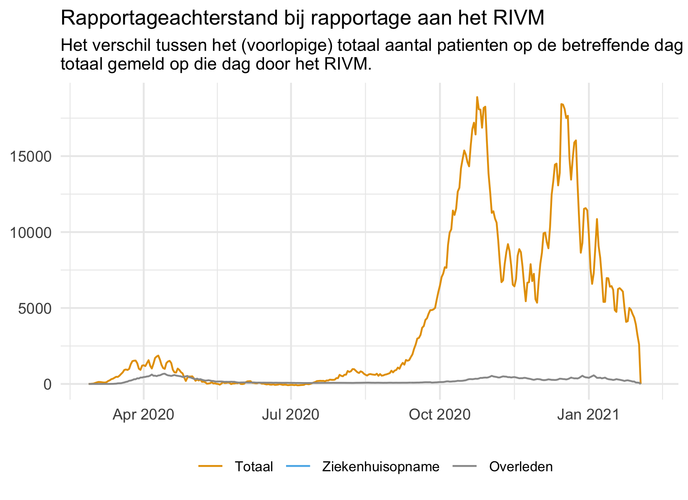

# CoronaWatchNL dataset remarks

## Cured COVID-19 patients

Since 3 March 2020, RIVM reports the number of diagnoses with the coronavirus and their municipality of residence on a daily base. The data contains the total number of positively tested patients. It is not a dataset with the current number of sick people in the Netherlands. The RIVM does not currently provide data on people who have been cured.

## Missing data on municipality level

A part of the data on municipal and provincial level is missing because they were not provided by RIVM. The following dates are important to take into acccount:

- 2020-03-31 untill 2020-04-06: Number of COVID-19 cases is not available on municipal and provincial level.
- 2020-02-27 untill 2020-04-07: Number of hospitalizations is not available on municipal and provincial level.
- 2020-02-27 untill 2020-04-18: Number of fatalities is not available on municipal and provincial level.

See the following chart of the municipality of Tilburg to get a feeling for this incompleteness.

## Differences between total on website and timeseries provided by RIVM

The charts in the section [Ontwikkeling COVID-19 in grafieken](https://www.rivm.nl/coronavirus-covid-19/grafieken) on the RIVM website ([see data](data/rivm_NL_covid19_national_by_date/rivm_NL_covid19_national_by_date_latest.csv)) differ from the daily reported numbers on the frontpage. The main reason is the reporting lag. This reporting lag is clearly visible in  the following graph:

 

The following chart shows the difference between the total numbers based on the charts and the daily reported numbers on the frontpage of RIVM. Please keep in mind that the reported numbers on the frontpage of RIVM do have different reference time (10 AM).

 

 ## Why is the number of hospitalisations lower than the total number on the RIVM website

The charts in the section [Ontwikkeling COVID-19 in grafieken](https://www.rivm.nl/coronavirus-covid-19/grafieken) on the RIVM website ([see data](data/rivm_NL_covid19_national_by_date/rivm_NL_covid19_national_by_date_latest.csv)) show different culumative numbers when compared with the total on the RIVM frontpage. For the number of patients and fatalities it adds up, but for hospitalizations it doesn't. This might be the result of a change of definition that is not applied to the total on the website.

> Vanaf 8 mei wijziging registratie ziekenhuisopname
De normale ziekenhuiszorg wordt steeds meer opgestart. Ziekenhuizen testen uit voorzorg steeds vaker mensen op het nieuwe coronavirus die om een andere reden dan COVID-19 in het ziekenhuis worden opgenomen. Dit gebeurt om verspreiding van COVID-19 binnen het ziekenhuis te voorkomen. Sinds 1 mei wordt daarom bij een melding van een positief geteste patiënt op COVID-19 nagevraagd wat de reden voor de ziekenhuisopname was.
Vanaf 8 mei geven we alleen nieuwe ziekenhuisopnames weer in de cijfers over ziekenhuisopnames waarbij COVID-19  de opnamereden is. De meldingen van patiënten die voor een andere reden in het ziekenhuis worden opgenomen en bij screening ook COVID-19 blijken te hebben worden toegevoegd aan het totaal aantal meldingen.

