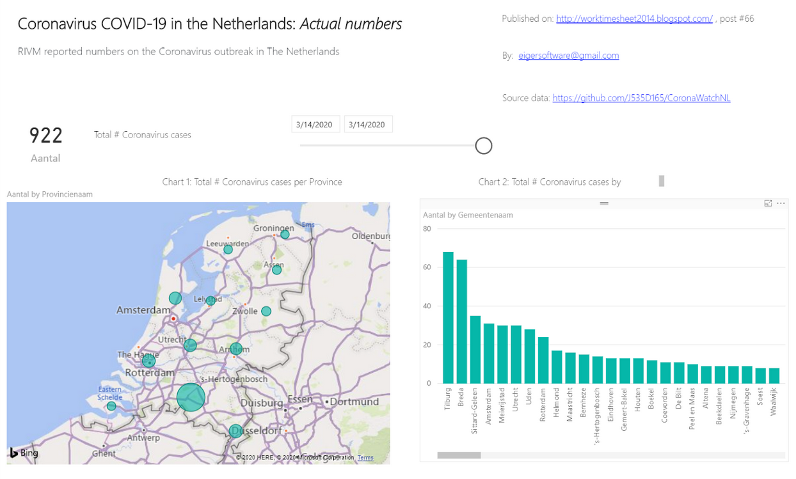

# Applications using CoronaWatchNL data

If you are interested in applications based on, inspired by, or similar to the CoronaWatchNL datasets, check out the following applications:

## Corona map NL and World
Current status and prognose for the Netherlands and the world:

[https://app.powerbi.com/view](https://app.powerbi.com/view?r=eyJrIjoiNjQwOTc0OTYtMzEwOC00ZDc0LWFjZjAtOTA2ZmI2OTQxYWYyIiwidCI6IjU1OTRjODBlLWRmNWYtNDgxNi1hMGIyLTg1NjhlMTVkMjY0YyIsImMiOjh9)

## Covid-Analytics
Covid Analytics in the Netherlands:

[https://covid-analytics.nl](https://covid-analytics.nl)

## GebiedsMonitor
Area monitor of COVID-19 in the Netherlands:

[https://covid19.wzwkaart.info/map/monitor](https://covid19.wzwkaart.info/map/monitor)

## Corona map
Overview hospital intakes:

[https://corona-map-nl.web.app/](https://corona-map-nl.web.app/)

## ValueCare
Summerizing Numbers of Corona:

[https://corona.searchdata.com/search?savedref=VC03320](https://corona.searchdata.com/search?savedref=VC03320)

## IC Dashboard
Visualizing (IC) data about diagnosed, hospitalized and deceased COVID-19 cases:

[https://digitalewereld.shinyapps.io/IC_Data_Dashboard/](https://digitalewereld.shinyapps.io/IC_Data_Dashboard/)

## Rode Kruis
Dynamic Spread of COVID:

[https://rodekruis.github.io/covid_spreiding/](https://rodekruis.github.io/covid_spreiding/)

## Excel example for your work, sports and more
Coronovirus in Netherlands Power BI report:

[https://worktimesheet2014.blogspot.com/2020/03/coronovirus-in-netherlands-power-bi.html](https://worktimesheet2014.blogspot.com/2020/03/coronovirus-in-netherlands-power-bi.html)

## Gemeente-wise daily new cases
Gemeente-wise daily new cases:

[https://shadkam.github.io/jsutils/html/covnl01.html](https://shadkam.github.io/jsutils/html/covnl01.html)

## Interesting links

### Medium
Coronavirus: Why You Must Act Now: [https://medium.com/@tomaspueyo/coronavirus-act-today-or-people-will-die-f4d3d9cd99ca](https://medium.com/@tomaspueyo/coronavirus-act-today-or-people-will-die-f4d3d9cd99ca)

### Casper Albers
Corona Graphs: [http://www.casperalbers.nl/nl/post/2020-03-11-coronagrafieken/](http://www.casperalbers.nl/nl/post/2020-03-11-coronagrafieken/)

### COVID-19 visualization
Exponential growth and epidemics: [https://www.youtube.com/watch?v=Kas0tIxDvrg](https://www.youtube.com/watch?v=Kas0tIxDvrg)
