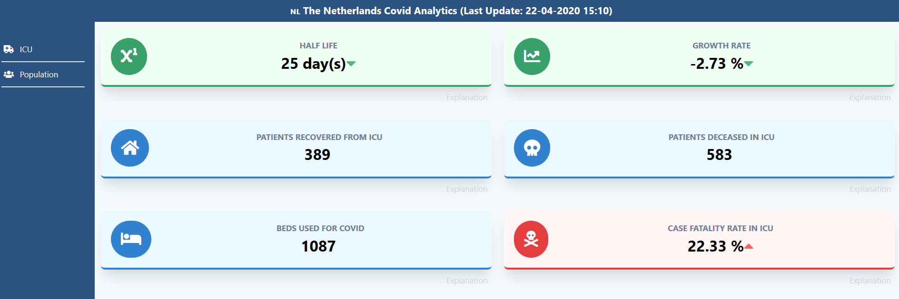
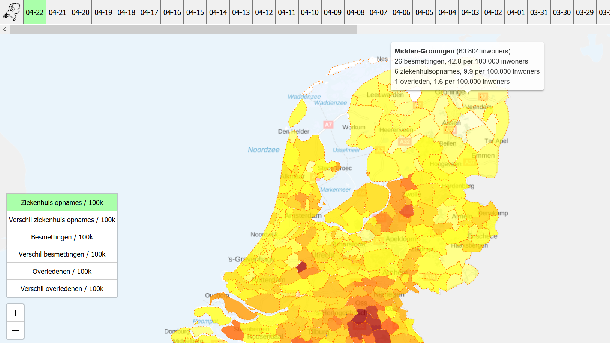
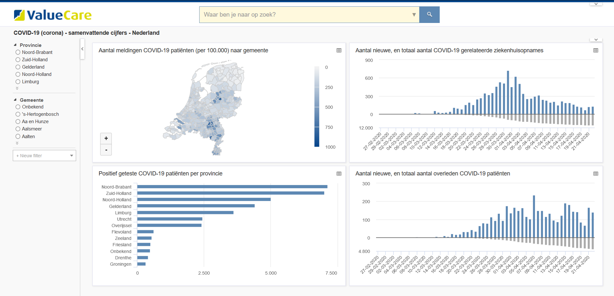
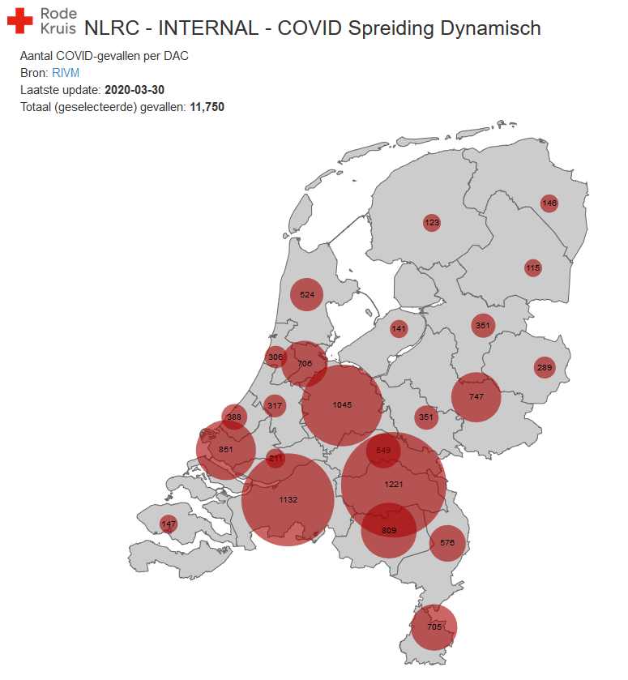

If you are interested in applications based on, inspired by, or similar to the CoronaWatchNL datasets, check out the following applications:

## Applications based on CoronaWatchNL data

### Covid-Analytics
Covid Analytics in the Netherlands: 

[https://covid-analytics.nl](https://covid-analytics.nl)

### Corona map
Overview hospital intakes: 

[https://corona-map-nl.web.app/](https://corona-map-nl.web.app/)

### ValueCare
Summerizing Numbers of Corona: 

[https://corona.searchdata.com/search?savedref=VC03320](https://corona.searchdata.com/search?savedref=VC03320)

### Rode Kruis
Dynamic Spread of COVID: 

[https://rodekruis.github.io/covid_spreiding/](https://rodekruis.github.io/covid_spreiding/)

### Excel example for your work, sports and more
Coronovirus in Netherlands Power BI report: 

[https://worktimesheet2014.blogspot.com/2020/03/coronovirus-in-netherlands-power-bi.html](https://worktimesheet2014.blogspot.com/2020/03/coronovirus-in-netherlands-power-bi.html) 

## Interesting links

### Medium
Coronavirus: Why You Must Act Now: [https://medium.com/@tomaspueyo/coronavirus-act-today-or-people-will-die-f4d3d9cd99ca](https://medium.com/@tomaspueyo/coronavirus-act-today-or-people-will-die-f4d3d9cd99ca)

### Casper Albers
Corona Graphs: [http://www.casperalbers.nl/nl/post/2020-03-11-coronagrafieken/](http://www.casperalbers.nl/nl/post/2020-03-11-coronagrafieken/)

### COVID-19 visualization
Exponential growth and epidemics: [https://www.youtube.com/watch?v=Kas0tIxDvrg](https://www.youtube.com/watch?v=Kas0tIxDvrg)